# :material-laptop: **Examples**

**`OmniGibson`** ships with many demo scripts highlighting its modularity and diverse feature set intended as a set of building blocks enabling your research. Let's try them out!

***

## :material-cog: **A quick word about macros**

??? question annotate "Why macros?"

    Macros enforce global behavior that is consistent within an individual python process but can differ between processes. This is useful because globally enabling all of **`OmniGibson`**'s features can cause unnecessary slowdowns, and so configuring the macros for your specific use case can optimize performance.

    For example, Omniverse provides a so-called `flatcache` feature which provides significant performance boosts, but cannot be used when fluids or soft bodies are present. So, we ideally should always have `gm.USE_FLATCACHE=True` unless we have fluids or soft bodies in our environment.

`macros` define a globally available set of magic numbers or flags set throughout **`OmniGibson`**. These can either be directly set in `omnigibson.macros.py`, or can be programmatically modified at runtime via:

```{.python .annotate}
from omnigibson.macros import gm, macros

gm.<GLOBAL_MACRO> = <VALUE> # (1)!
macros.<OG_DIRECTORY>.<OG_MODULE>.<MODULE_MACRO> = <VALUE> # (2)!
```

1. `gm` refers to the "global" macros -- i.e.: settings that generally impact the entire **`OmniGibson`** stack. These are usually the only settings you may need to modify.
2. `macros` captures all remaining macros defined throughout **`OmniGibson`**'s codebase -- these are often hardcoded default settings or magic numbers defined in a specific module. These can also be overridden, but we recommend inspecting the module first to understand how it is used.

Many of our examples set various `macros` settings at the beginning of the script, and is a good way to understand use cases for modifying them!

***

## :material-earth: **Environments**
These examples showcase the full **`BEHAVIOR`** stack in use, and the types of environments immediately supported.

### **BEHAVIOR Task Demo**

<div class="grid cards" markdown>

- !!! abstract "This demo is useful for..."

    * Understanding how to instantiate a BEHAVIOR task
    * Understanding how a pre-defined configuration file is used

    This demo instantiates one of our BEHAVIOR tasks (and optionally sampling object locations online) in a fully-populated scene and loads a `R1Pro` robot. The robot executes random actions and the environment is reset periodically.

- 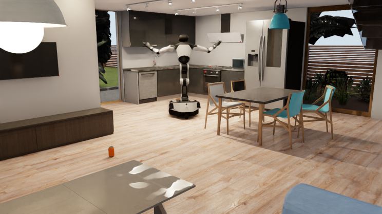{ loading=lazy }

</div>

```{.python .annotate}
python -m omnigibson.examples.environments.behavior_env_demo
```

??? code "behavior_env_demo.py"

    ``` py linenums="1"
    --8<-- "examples/environments/behavior_env_demo.py"
    ```

### **Navigation Task Demo**

<div class="grid cards" markdown>

- !!! abstract "This demo is useful for..."

    * Understanding how to instantiate a navigation task
    * Understanding how a pre-defined configuration file is used

    This demo instantiates one of our navigation tasks in a fully-populated scene and loads a `Turtlebot` robot. The robot executes random actions and the environment is reset periodically.

- 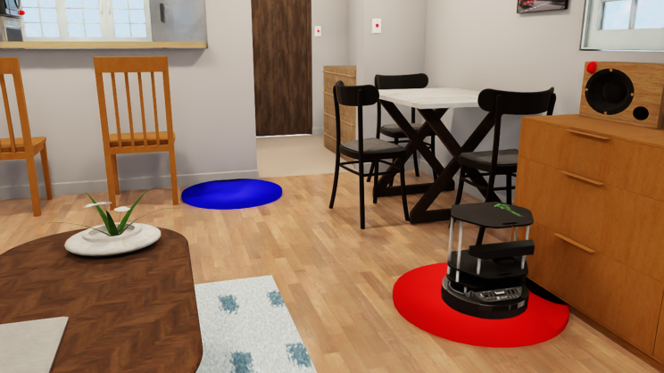{ loading=lazy }

</div>

```{.python .annotate}
python -m omnigibson.examples.environments.navigation_env_demo
```

??? code "navigation_env_demo.py"

    ``` py linenums="1"
    --8<-- "examples/environments/navigation_env_demo.py"
    ```

### **Vector Environment Demo**

<div class="grid cards" markdown>

- !!! abstract "This demo is useful for..."

    * Understanding how to instantiate multiple parallel environments using VectorEnvironment
    * Benchmarking environment performance with parallel execution
    * Learning how to configure batch simulation settings

    This demo instantiates multiple parallel environments using `VectorEnvironment` with 5 environments running simultaneously. Each environment loads a `FrankaPanda` robot and executes random actions independently. The demo measures and reports frames per second (FPS) and effective (aggregated) FPS across all environments.

- { loading=lazy }

</div>

```{.python .annotate}
python -m omnigibson.examples.environments.vector_env_demo
```

??? code "vector_env_demo.py"

    ``` py linenums="1"
    --8<-- "examples/environments/vector_env_demo.py"
    ```

## :material-school: **Learning**
These examples showcase how **`OmniGibson`** can be used to train embodied AI agents.

### **Reinforcement Learning Demo**

<div class="grid cards" markdown>

- !!! abstract "This demo is useful for..."

    * Understanding how to hook up **`OmniGibson`** to an external algorithm
    * Understanding how to train and evaluate a policy

    This demo loads a BEHAVIOR task with a `TurtleBot` robot, and trains / evaluates the agent using [Stable Baseline3](https://stable-baselines3.readthedocs.io/en/master/)'s PPO algorithm.

- 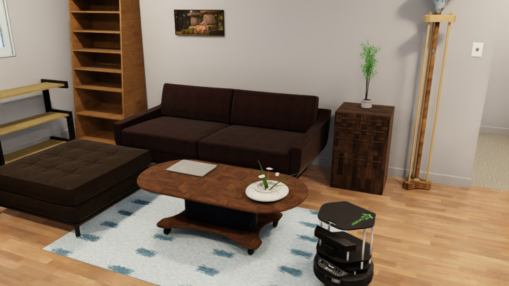{ loading=lazy }

</div>

!!! note "Required Dependencies"
    This demo requires stable-baselines for reinforcement learning. If not already installed, run:
    ```bash
    pip install stable-baselines3[extra]
    ```

```{.python .annotate}
python -m omnigibson.examples.learning.navigation_policy_demo
```

??? code "navigation_policy_demo.py"

    ``` py linenums="1"
    --8<-- "examples/learning/navigation_policy_demo.py"
    ```

## :fontawesome-solid-mountain: **Scenes**
These examples showcase how to leverage **`OmniGibson`**'s large-scale, diverse scenes shipped with the BEHAVIOR dataset.

### **Scene Selector Demo**

<div class="grid cards" markdown>

- !!! abstract "This demo is useful for..."

    * Understanding how to load a scene into **`OmniGibson`**
    * Accessing all BEHAVIOR dataset scenes

    This demo lets you choose a scene from the BEHAVIOR dataset and load it.

- 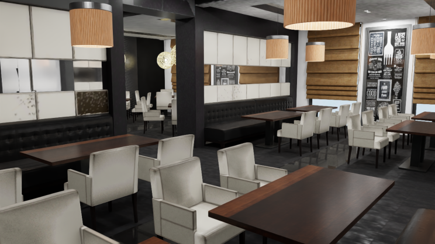{ loading=lazy }

</div>

```{.python .annotate}
python -m omnigibson.examples.scenes.scene_selector
```

??? code "scene_selector.py"

    ``` py linenums="1"
    --8<-- "examples/scenes/scene_selector.py"
    ```

### **Scene Tour Demo**

<div class="grid cards" markdown>

- !!! abstract "This demo is useful for..."

    * Understanding how to load a scene into **`OmniGibson`**
    * Understanding how to generate a trajectory from a set of waypoints

    This demo lets you choose a scene from the BEHAVIOR dataset. It allows you to move the camera using the keyboard, select waypoints, and then programmatically generates a video trajectory from the selected waypoints

- 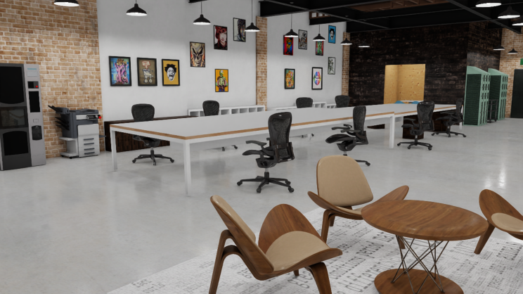{ loading=lazy }

</div>

```{.python .annotate}
python -m omnigibson.examples.scenes.scene_tour_demo
```

??? code "scene_tour_demo.py"

    ``` py linenums="1"
    --8<-- "examples/scenes/scene_tour_demo.py"
    ```

### **Traversability Map Demo**

<div class="grid cards" markdown>

- !!! abstract "This demo is useful for..."

    * Understanding how to leverage traversability map information from BEHAVIOR dataset scenes

    This demo lets you choose a scene from the BEHAVIOR dataset, and generates its corresponding traversability map.

- 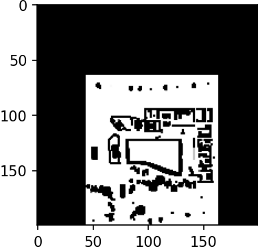{ loading=lazy }

</div>

```{.python .annotate}
python -m omnigibson.examples.scenes.traversability_map_example
```

??? code "traversability_map_example.py"

    ``` py linenums="1"
    --8<-- "examples/scenes/traversability_map_example.py"
    ```

## :material-food-apple: **Objects**
These examples showcase how to leverage objects in **`OmniGibson`**.

### **Load Object Demo**

<div class="grid cards" markdown>

- !!! abstract "This demo is useful for..."

    * Understanding how to load an object into **`OmniGibson`**
    * Accessing all BEHAVIOR dataset asset categories and models

    This demo lets you choose a specific object from the BEHAVIOR dataset, and loads the requested object into an environment.

- 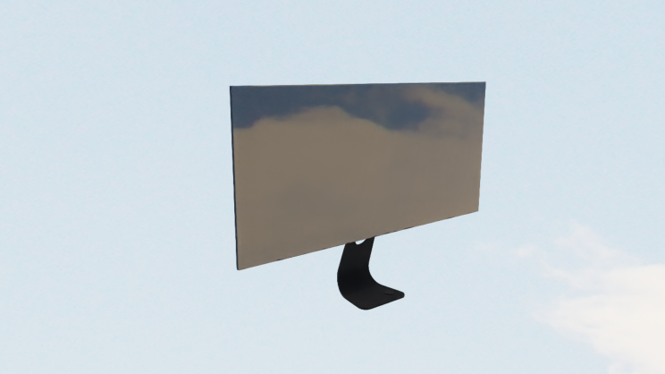{ loading=lazy }

</div>

```{.python .annotate}
python -m omnigibson.examples.objects.load_object_selector
```

??? code "load_object_selector.py"

    ``` py linenums="1"
    --8<-- "examples/objects/load_object_selector.py"
    ```

### **Object Visualizer Demo**

<div class="grid cards" markdown>

- !!! abstract "This demo is useful for..."

    * Viewing objects' textures as rendered in **`OmniGibson`**
    * Viewing articulated objects' range of motion
    * Understanding how to reference object instances from the environment
    * Understanding how to set object poses and joint states

    This demo lets you choose a specific object from the BEHAVIOR dataset, and rotates the object in-place. If the object is articulated, it additionally moves its joints through its full range of motion.

- 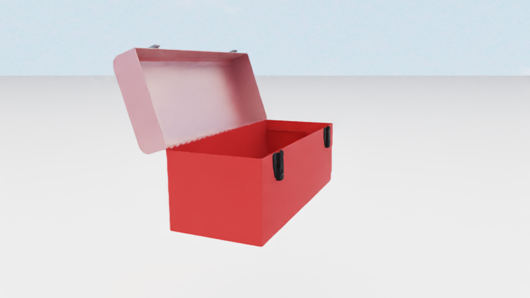{ loading=lazy }

</div>

```{.python .annotate}
python -m omnigibson.examples.objects.visualize_object
```

??? code "visualize_object.py"

    ``` py linenums="1"
    --8<-- "examples/objects/visualize_object.py"
    ```

### **Highlight Object**

<div class="grid cards" markdown>

- !!! abstract "This demo is useful for..."

    * Understanding how to highlight individual objects within a cluttered scene
    * Understanding how to access groups of objects from the environment

    This demo loads the Rs_int scene and highlights windows on/off repeatedly.

- 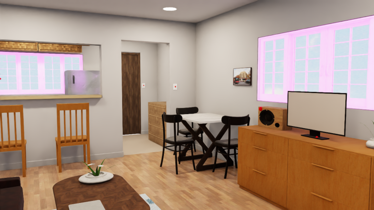{ loading=lazy }

</div>

```{.python .annotate}
python -m omnigibson.examples.objects.highlight_objects
```

??? code "highlight_objects.py"

    ``` py linenums="1"
    --8<-- "examples/objects/highlight_objects.py"
    ```

### **Draw Object Bounding Box Demo**

<div class="grid cards" markdown>

- !!! abstract annotate "This demo is useful for..."

    * Understanding how to access observations from a `GymObservable` object
    * Understanding how to access objects' bounding box information
    * Understanding how to dynamically modify vision modalities

    This demo loads a door object and banana object, and partially obscures the banana with the door. It generates both "loose" and "tight" bounding boxes (where the latter respects occlusions) for both objects, and dumps them to an image on disk.

- { loading=lazy }

</div>

*[GymObservable]: [`Environment`](../reference/envs/env_base.md), all sensors extending from [`BaseSensor`](../reference/sensors/sensor_base.md), and all objects extending from [`BaseObject`](../reference/objects/object_base.md) (which includes all robots extending from [`BaseRobot`](../reference/robots/robot_base.md)!) are [`GymObservable`](../reference/utils/gym_utils.md#utils.gym_utils.GymObservable) objects!

```{.python .annotate}
python -m omnigibson.examples.objects.draw_bounding_box
```

??? code "draw_bounding_box.py"

    ``` py linenums="1"
    --8<-- "examples/objects/draw_bounding_box.py"
    ```

## :material-thermometer: **Object States**
These examples showcase **`OmniGibson`**'s powerful object states functionality, which captures both individual and relational kinematic and non-kinematic states.

### **Slicing Demo**

<div class="grid cards" markdown>

- !!! abstract "This demo is useful for..."

    * Understanding how slicing works in **`OmniGibson`**
    * Understanding how to access individual objects once the environment is created

    This demo spawns an apple on a table with a knife above it, and lets the knife fall to "cut" the apple in half.

- 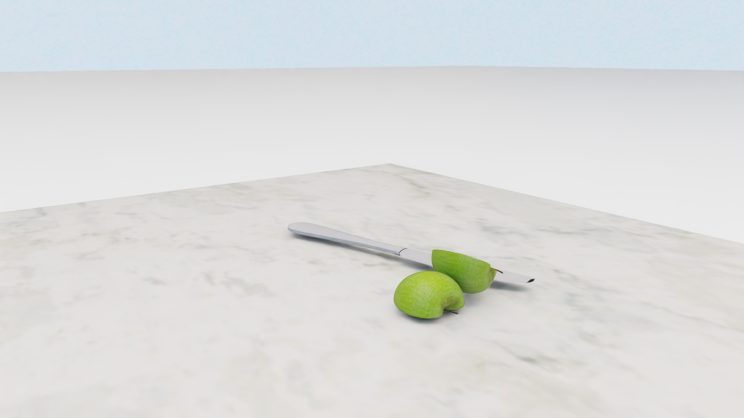{ loading=lazy }

</div>

```{.python .annotate}
python -m omnigibson.examples.object_states.slicing_demo
```

??? code "slicing_demo.py"

    ``` py linenums="1"
    --8<-- "examples/object_states/slicing_demo.py"
    ```

### **Dicing Demo**

<div class="grid cards" markdown>

- !!! abstract "This demo is useful for..."

    * Understanding how to leverage the `Dicing` state
    * Understanding how to enable objects to be `diceable`

    This demo loads an apple and a knife, and showcases how apple can be diced into smaller chunks with the knife.

- 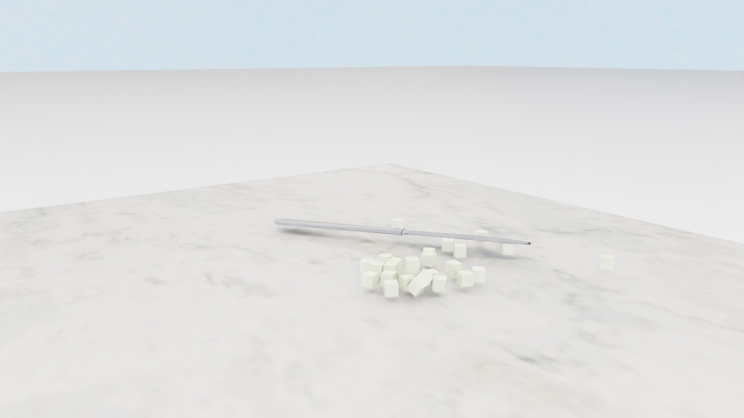{ loading=lazy }

</div>

```{.python .annotate}
python -m omnigibson.examples.object_states.dicing_demo
```

??? code "dicing_demo.py"

    ``` py linenums="1"
    --8<-- "examples/object_states/dicing_demo.py"
    ```

### **Folded and Unfolded Demo**

<div class="grid cards" markdown>

- !!! abstract "This demo is useful for..."

    * Understanding how to load a softbody (cloth) version of a BEHAVIOR dataset object
    * Understanding how to enable cloth objects to be `foldable` 
    * Understanding the current heuristics used for gauging a cloth's "foldness"

    This demo loads in three different cloth objects, and allows you to manipulate them while printing out their `Folded` state status in real-time. Try manipulating the object by holding down **`Shift`** and then **`Left-click + Drag`**!

- { loading=lazy }

</div>

```{.python .annotate}
python -m omnigibson.examples.object_states.folded_unfolded_state_demo
```

??? code "folded_unfolded_state_demo.py"

    ``` py linenums="1"
    --8<-- "examples/object_states/folded_unfolded_state_demo.py"
    ```

### **Overlaid Demo**

<div class="grid cards" markdown>

- !!! abstract "This demo is useful for..."

    * Understanding how cloth objects can be overlaid on rigid objects
    * Understanding current heuristics used for gauging a cloth's "overlaid" status

    This demo loads in a carpet on top of a table. The demo allows you to manipulate the carpet while printing out their `Overlaid` state status in real-time. Try manipulating the object by holding down **`Shift`** and then **`Left-click + Drag`**!

- { loading=lazy }

</div>

```{.python .annotate}
python -m omnigibson.examples.object_states.overlaid_demo
```

??? code "overlaid_demo.py"

    ``` py linenums="1"
    --8<-- "examples/object_states/overlaid_demo.py"
    ```

### **Heat Source or Sink Demo**

<div class="grid cards" markdown>

- !!! abstract "This demo is useful for..."

    * Understanding how a heat source (or sink) is visualized in **`OmniGibson`**
    * Understanding how dynamic fire visuals are generated in real-time

    This demo loads in a stove and toggles its `HeatSource` on and off, showcasing the dynamic fire visuals available in **`OmniGibson`**.

- 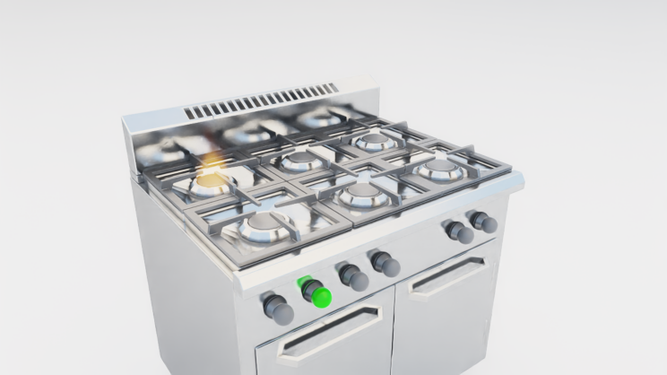{ loading=lazy }

</div>

```{.python .annotate}
python -m omnigibson.examples.object_states.heat_source_or_sink_demo
```

??? code "heat_source_or_sink_demo.py"

    ``` py linenums="1"
    --8<-- "examples/object_states/heat_source_or_sink_demo.py"
    ```

### **Temperature Demo**

<div class="grid cards" markdown>

- !!! abstract "This demo is useful for..."

    * Understanding how to dynamically sample kinematic states for BEHAVIOR dataset objects
    * Understanding how temperature changes are propagated to individual objects from individual heat sources or sinks

    This demo loads in various heat sources and sinks, and places an apple within close proximity to each of them. As the environment steps, each apple's temperature is printed in real-time, showcasing **`OmniGibson`**'s rudimentary temperature dynamics.

- 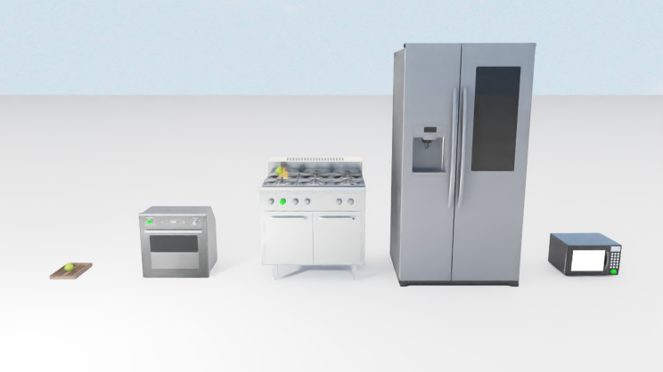{ loading=lazy }

</div>

```{.python .annotate}
python -m omnigibson.examples.object_states.temperature_demo
```

??? code "temperature_demo.py"

    ``` py linenums="1"
    --8<-- "examples/object_states/temperature_demo.py"
    ```

### **Heated Demo**

<div class="grid cards" markdown>

- !!! abstract "This demo is useful for..."

    * Understanding how temperature modifications can cause objects' visual changes
    * Understanding how dynamic steam visuals are generated in real-time

    This demo loads in three bowls, and immediately sets their temperatures past their `Heated` threshold. Steam is generated in real-time from these objects, and then disappears once the temperature of the objects drops below their `Heated` threshold.

- 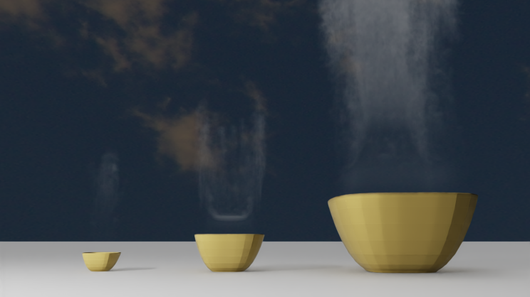{ loading=lazy }

</div>

```{.python .annotate}
python -m omnigibson.examples.object_states.heated_state_demo
```

??? code "heated_state_demo.py"

    ``` py linenums="1"
    --8<-- "examples/object_states/heated_state_demo.py"
    ```

### **Onfire Demo**

<div class="grid cards" markdown>

- !!! abstract "This demo is useful for..."

    * Understanding how changing onfire state can cause objects' visual changes
    * Understanding how onfire can be triggered by nearby onfire objects

    This demo loads in a stove (toggled on) and two apples. The first apple will be ignited by the stove first, then the second apple will be ignited by the first apple.

- 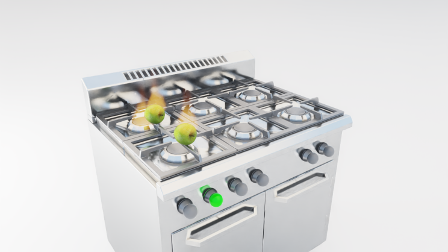{ loading=lazy }

</div>

```{.python .annotate}
python -m omnigibson.examples.object_states.onfire_demo
```

??? code "onfire_demo.py"

    ``` py linenums="1"
    --8<-- "examples/object_states/onfire_demo.py"
    ```

### **Particle Applier and Remover Demo**

<div class="grid cards" markdown>

- !!! abstract "This demo is useful for..."

    * Understanding how a `ParticleRemover` or `ParticleApplier` object can be generated
    * Understanding how particles can be dynamically generated on objects
    * Understanding different methods for applying and removing particles via the `ParticleRemover` or `ParticleApplier` object

    This demo loads in a washtowel and table and lets you choose the ability configuration to enable the washtowel with. The washtowel will then proceed to either remove and generate particles dynamically on the table while moving.

- 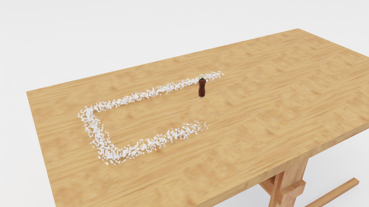{ loading=lazy }

</div>

```{.python .annotate}
python -m omnigibson.examples.object_states.particle_applier_remover_demo
```

??? code "particle_applier_remover_demo.py"

    ``` py linenums="1"
    --8<-- "examples/object_states/particle_applier_remover_demo.py"
    ```

### **Particle Source and Sink Demo**

<div class="grid cards" markdown>

- !!! abstract "This demo is useful for..."

    * Understanding how a `ParticleSource` or `ParticleSink` object can be generated
    * Understanding how particles can be dynamically generated and destroyed via such objects

    This demo loads in a sink, which is enabled with both the ParticleSource and ParticleSink states. The sink's particle source is located at the faucet spout and spawns a continuous stream of water particles, which is then destroyed ("sunk") by the sink's particle sink located at the drain.

- 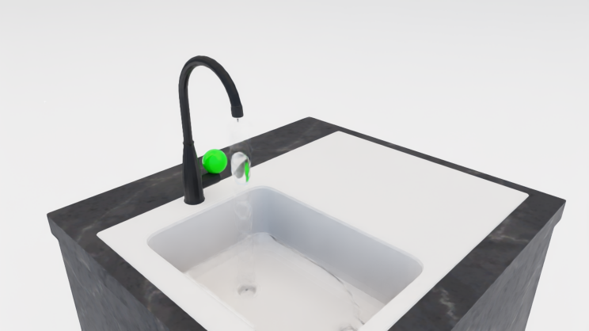{ loading=lazy }

</div>

```{.python .annotate}
python -m omnigibson.examples.object_states.particle_source_sink_demo
```

??? note "Difference between `ParticleApplier/Removers` and `ParticleSource/Sinks`"
    The key difference between `ParticleApplier/Removers` and `ParticleSource/Sinks` is that `Applier/Removers`
    requires contact (if using `ParticleProjectionMethod.ADJACENCY`) or overlap
    (if using `ParticleProjectionMethod.PROJECTION`) in order to spawn / remove particles, and generally only spawn
    particles at the contact points. `ParticleSource/Sinks` are special cases of `ParticleApplier/Removers` that
    always use `ParticleProjectionMethod.PROJECTION` and always spawn / remove particles within their projection volume,
    irregardless of overlap with other objects.

??? code "particle_source_sink_demo.py"

    ``` py linenums="1"
    --8<-- "examples/object_states/particle_source_sink_demo.py"
    ```

### **Kinematics Demo**

<div class="grid cards" markdown>

- !!! abstract "This demo is useful for..."

    * Understanding how to dynamically sample kinematic states for BEHAVIOR dataset objects
    * Understanding how to import additional objects after the environment is created

    This demo procedurally generates a mini populated scene, spawning in a cabinet and placing boxes in its shelves, and then generating a microwave on a cabinet with a plate and apples sampled both inside and on top of it.

- 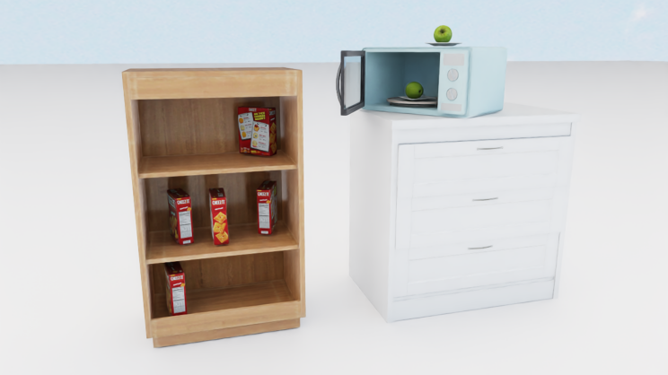{ loading=lazy }

</div>

```{.python .annotate}
python -m omnigibson.examples.object_states.sample_kinematics_demo
```

??? code "sample_kinematics_demo.py"

    ``` py linenums="1"
    --8<-- "examples/object_states/sample_kinematics_demo.py"
    ```

### **Attachment Demo**

<div class="grid cards" markdown>

- !!! abstract "This demo is useful for..."

    * Understanding how to leverage the `Attached` state
    * Understanding how to enable objects to be `attachable`

    This demo loads an assembled shelf, and showcases how it can be manipulated to attach and detach parts.

- 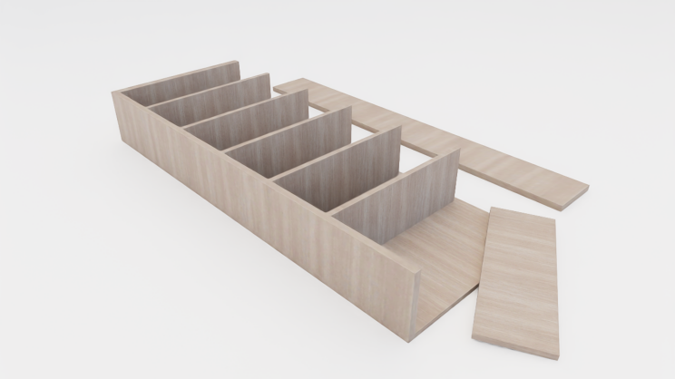{ loading=lazy }

</div>

```{.python .annotate}
python -m omnigibson.examples.object_states.attachment_demo
``` 

??? code "attachment_demo.py"

    ``` py linenums="1"
    --8<-- "examples/object_states/attachment_demo.py"
    ```

### **Object Texture Demo**

<div class="grid cards" markdown>

- !!! abstract "This demo is useful for..."

    * Understanding how different object states can result in texture changes
    * Understanding how to enable objects with texture-changing states
    * Understanding how to dynamically modify object states

    This demo loads in a single object, and then dynamically modifies its state so that its texture changes with each modification.

- 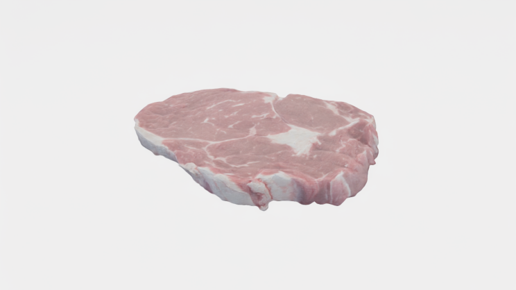{ loading=lazy }

</div>

```{.python .annotate}
python -m omnigibson.examples.object_states.object_state_texture_demo
```

??? code "object_state_texture_demo.py"

    ``` py linenums="1"
    --8<-- "examples/object_states/object_state_texture_demo.py"
    ```

## :material-robot-excited: **Robots**
These examples showcase how to interact and leverage robot objects in **`OmniGibson`**.

### **Robot Visualizer Demo**

<div class="grid cards" markdown>

- !!! abstract "This demo is useful for..."

    * Understanding how to load a robot into **`OmniGibson`** after an environment is created
    * Accessing all **`OmniGibson`** robot models
    * Viewing robots' low-level joint motion

    This demo iterates over all robots in **`OmniGibson`**, loading each one into an empty scene and randomly moving its joints for a brief amount of time.

- 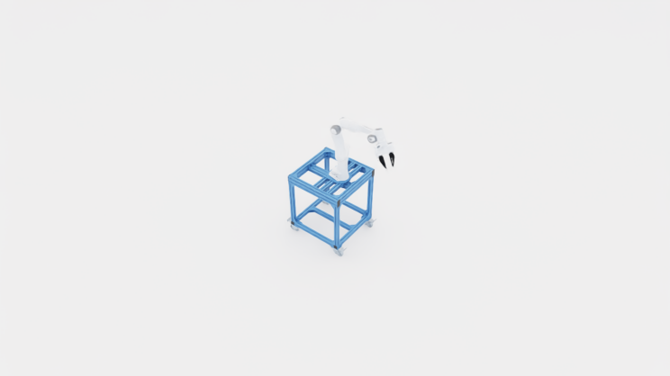{ loading=lazy }

</div>

```{.python .annotate}
python -m omnigibson.examples.robots.all_robots_visualizer
```

??? code "all_robots_visualizer.py"

    ``` py linenums="1"
    --8<-- "examples/robots/all_robots_visualizer.py"
    ```

### **Robot Control Demo**

<div class="grid cards" markdown>

- !!! abstract "This demo is useful for..."

    * Understanding how different controllers can be used to control robots
    * Understanding how to teleoperate a robot through external commands

    This demo lets you choose a robot and the set of controllers to control the robot, and then lets you teleoperate the robot using your keyboard.

- 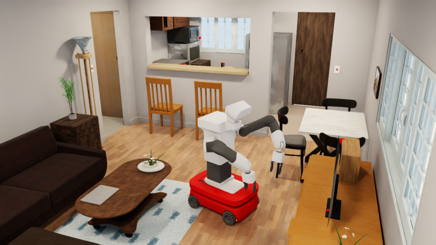{ loading=lazy }

</div>

```{.python .annotate}
python -m omnigibson.examples.robots.robot_control_example
```

??? code "robot_control_example.py"

    ``` py linenums="1"
    --8<-- "examples/robots/robot_control_example.py"
    ```

### **Robot Grasping Demo**

<div class="grid cards" markdown>

- !!! abstract annotate "This demo is useful for..."

    * Understanding the difference between `physical` and `sticky` grasping
    * Understanding how to teleoperate a robot through external commands

    This demo lets you choose a grasping mode and then loads a `Fetch` robot and a cube on a table. You can then teleoperate the robot to grasp the cube, observing the difference is grasping behavior based on the grasping mode chosen. Here, `physical` means natural friction is required to hold objects, while `sticky` means that objects are constrained to the robot's gripper once contact is made.

- 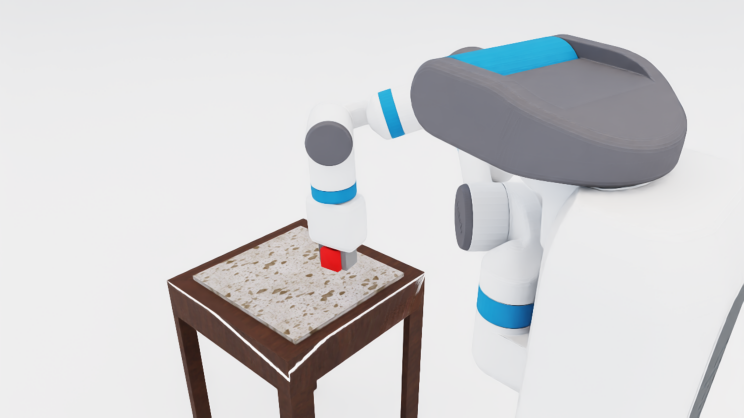{ loading=lazy }

</div>

```{.python .annotate}
python -m omnigibson.examples.robots.grasping_mode_example
``` 

??? code "grasping_mode_example.py"

    ``` py linenums="1"
    --8<-- "examples/robots/grasping_mode_example.py"
    ```

## :material-wrench: **Simulator**
These examples showcase useful functionality from **`OmniGibson`**'s monolithic `Simulator` object.

??? question "What's the difference between `Environment` and `Simulator`?"

    The [`Simulator`](../reference/simulator.md) class is a lower-level object that:
      
      * handles importing scenes and objects into the actual simulation
      * directly interfaces with the underlying physics engine

    The [`Environment`](../reference/envs/env_base.md) class thinly wraps the `Simulator`'s core functionality, by:

      * providing convenience functions for automatically importing a predefined scene, object(s), and robot(s) (via the `cfg` argument), as well as a [`task`](../reference/tasks/task_base.md)
      * providing a OpenAI Gym interface for stepping through the simulation

    While most of the core functionality in `Environment` (as well as more fine-grained physics control) can be replicated via direct calls to `Simulator` (`og.sim`), it requires deeper understanding of **`OmniGibson`**'s infrastructure and is not recommended for new users.

### **State Saving and Loading Demo**

<div class="grid cards" markdown>

- !!! abstract "This demo is useful for..."

    * Understanding how to interact with objects using the mouse
    * Understanding how to save the active simulator state to a file
    * Understanding how to restore the simulator state from a given file

    This demo loads a stripped-down scene with the `Turtlebot` robot, and lets you interact with objects to modify the scene. The state is then saved, written to a `.json` file, and then restored in the simulation.

- 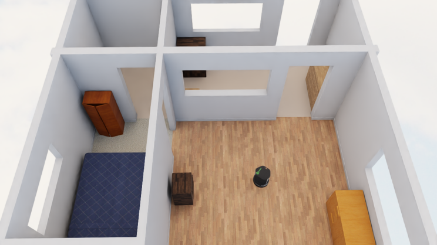{ loading=lazy }

</div>

```{.python .annotate}
python -m omnigibson.examples.simulator.sim_save_load_example
```

??? code "sim_save_load_example.py"

    ``` py linenums="1"
    --8<-- "examples/simulator/sim_save_load_example.py"
    ```
